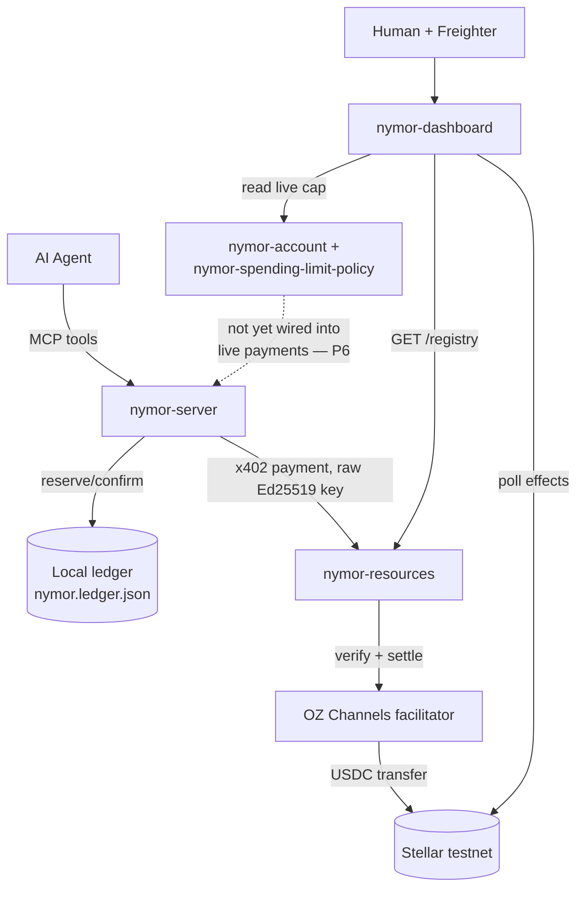

<h1 align="center">Nymor</h1>

<p align="center">
  <strong>We gave an AI agent a wallet, a target, and no leash — then made the blockchain itself say no.</strong>
</p>

<p align="center">
  <a href="https://developers.stellar.org/docs/build/agentic-payments/x402"></a>
  <a href="https://stellar.expert/explorer/testnet/contract/CAF2HV5N57UDZOMGD2WC4BI472Z3CRSQYQ2V4AKPPP5W4PD4HC4LBKVW"></a>
  <a href="https://modelcontextprotocol.io"></a>
  <a href="https://github.com/debojyoti10CC/nymor"></a>
</p>

---

## The 30-Second Version

Every framework that lets an AI agent spend money says "don't worry, there's a budget." Almost none of them can show you the moment that budget actually got enforced — because the enforcement is a number checked in application code, sitting in the exact same trust boundary as the agent it's supposed to be restraining. If the agent's own logic is ever wrong, compromised, or just cleverly prompted, that budget was never a wall. It was a Post-it note.

So we deployed a Soroban smart account on Stellar, pointed a real AI-agent payment flow at it, and tried to make it overspend. We signed a transaction by hand — reverse-engineering an authorization scheme so undocumented that OpenZeppelin's own SDK admits it "requires manual authorization entry crafting" and ships zero reference code for it — and pushed it straight at the contract.

**The network rejected it.** Not a test assertion. Not a mocked response. A real transaction, submitted to Stellar testnet, bounced back with `Error(Contract, #3221): SpendingLimitExceeded` — [check it yourself](https://stellar.expert/explorer/testnet/tx/d0f3e128df2bd2d2582a532c32e119dedd1957afdaa79f50412eebca76965f74). Then we sent a smaller one and watched it clear. Two transactions, one contract, zero ambiguity about which one the chain lets through.

That's Nymor: an MCP server that lets any AI agent discover paid APIs, pay for them in real USDC over x402, and hit a spend cap it is *structurally incapable* of talking its way past — because the "no" doesn't come from the agent's own code anymore. It comes from the network.

Everything below is receipts, not adjectives. Six claims, each with a transaction hash or a test file. One gap, disclosed on purpose instead of buried.

---

## At a Glance

- Run `pnpm dev:resources` — boots a real seller process with five paid endpoints, each backed by a genuine upstream (Horizon, an LLM, an image model, a weather API), not a stub.
- Run `pnpm dev:server` — starts the MCP server an agent actually talks to: `discover`, `pay_and_call`, `spend_status`, `register_resource`.
- Run `RUN_INTEGRATION=1 pnpm test` — moves real testnet USDC and prints a settled transaction hash, over the real MCP stdio transport, not a direct function import.
- Run `pnpm dev:dashboard` — the same product for a human: browse the catalog, watch real payments land, pay with your own wallet, read the live on-chain spend cap.

---

## Problem

Every "AI agent pays for things" pitch eventually has to answer one question: what actually stops the agent from spending past its budget? Most answers are "the application checks a number before making the call" — which is real engineering, but it lives in the same trust boundary as the agent itself. A bug in that check, a prompt injection that convinces the agent to route around its own tool, a dependency that silently changes behavior — any of those and the budget was never really a budget, it was a suggestion the agent's own code happened to follow.

The honest fix isn't a bigger try/catch. It's moving the enforcement somewhere the agent's own execution path can't reach: the settlement layer itself.

---

## Solution

Nymor is an MCP server that lets any MCP-connected agent discover paid API resources, pay for them in real USDC settled on Stellar via [x402](https://developers.stellar.org/docs/build/agentic-payments/x402), and stay inside a spend cap enforced two ways — a race-safe application ledger, and a Soroban smart-account contract that Stellar itself refuses to let overspend.

Both layers are real. Only one of them is currently load-bearing for live agent payments, and that gap is documented precisely rather than glossed over — see [P6](#what-nymor-proves) below and `packages/policy/README.md`.

---

## What Nymor Proves

Every row cites a real test file or a real transaction — the same discipline as a conformance suite, applied to a payments product instead of a protocol implementation.

| ID | Claim | Status | Evidence |
|----|-------|--------|----------|
| P1 | x402 settles real USDC on Stellar testnet | ✅ proven | `RUN_INTEGRATION=1 pnpm test`, tx [`26a0e061…`](https://stellar.expert/explorer/testnet/tx/26a0e061083acd919aeea55d66e95ac8d93d9952c5bb7a1ba1dc9998d419c0d7) |
| P2 | MCP wiring works over the real stdio protocol, not a direct import | ✅ proven | `mcp.integration.test.ts`, tx [`6347154e…`](https://stellar.expert/explorer/testnet/tx/6347154e932dfeca2116f3b0a46298f94468f506fa613e3b5fa15e08554cf01a) |
| P3 | Concurrent spend requests can't double-spend past the cap | ✅ proven | 20-way concurrency test, `ledger.test.ts` |
| P4 | The on-chain smart account authorizes a transfer under its cap | ✅ proven | tx [`e4358552…`](https://stellar.expert/explorer/testnet/tx/e4358552e77b46c87a5ff408bd42cd63efbf26a276e41806148b364a6bd1c4b2), `successful: true` |
| **P5** | **The on-chain smart account rejects a transfer over its cap — on-chain, not in a test** | ✅ **proven — headline** | tx [`d0f3e128…`](https://stellar.expert/explorer/testnet/tx/d0f3e128df2bd2d2582a532c32e119dedd1957afdaa79f50412eebca76965f74), `Error(Contract, #3221)` `SpendingLimitExceeded` |
| P6 | Real agent payments are routed through that on-chain cap | ❌ **not wired up (disclosed)** | Buyer signer is still a raw Ed25519 key — `@x402/stellar` has no hook for the custom signature shape OZ smart accounts require. See `packages/policy/README.md`. |

### P5 — the headline transaction

`nymor-account`'s spend cap isn't application code deciding to refuse a call — it's `Error(Contract, #3221)` raised from inside the Soroban host's own authorization check, before any transfer executes. Proving it required more than deploying the contract: OZ's own documentation states that the `Delegated` signer scheme "requires manual authorization entry crafting, because it is not returned in a simulation mode," with no reference implementation anywhere in their repository. Getting a real signed transaction through meant reading `soroban-env-host`'s `auth.rs` directly to find the undocumented second authorization entry the host actually requires — full trail in `packages/policy/README.md`.

Two real transactions prove it, not one: an accepted transfer under the cap, and a rejected one over it. A single passing case only proves the contract doesn't crash — the rejection is what proves it enforces anything.

---

## Architecture



```
packages/
├── resources/    seller side — 5 real paid endpoints + GET /registry
├── server/       the product — MCP server (discover, pay_and_call, spend_status, register_resource)
├── policy/       Soroban smart-account contracts, deployed + proven on testnet
└── dashboard/    public web app — marketplace, live activity, on-chain policy, try-it-yourself
```

---

## The Resource Catalog

| Resource | Method | Price | Upstream |
|---|---|---|---|
| Live XLM/USD price | GET | $0.01 | CoinGecko |
| Text summarization | POST | $0.02 | OpenRouter (real LLM, free-tier model) |
| Stellar account balance | GET | $0.01 | Stellar Horizon |
| Image generation | POST | $0.03 | Pollinations.ai |
| Current weather | GET | $0.01 | Open-Meteo |

Every one of these has been paid for end-to-end at least once with a real settled transaction — not just registered and assumed to work. Building `generate-image` surfaced a real bug (`payAndFetch` assumed every response was JSON, silently discarding a payment that had already settled the moment a resource returned image bytes instead) — fixed the same day it was found, by actually paying for the resource rather than trusting the code path unexercised.

---

## Sample Output

Real data, captured from an actual run — not illustrative placeholder JSON:

```
$ pnpm dev:server
[nymor-server] listening over stdio

# "what paid resources does nymor know about?"
→ nymor.discover()
{
  "resources": [
    { "id": "xlm-price", "price_usd": 0.01, ... },
    { "id": "stellar-balance", "price_usd": 0.01, ... },
    { "id": "weather", "price_usd": 0.01, ... },
    { "id": "generate-image", "price_usd": 0.03, ... },
    { "id": "summarize", "price_usd": 0.02, ... }
  ]
}

# "get the weather at 51.5, -0.12"
→ nymor.pay_and_call({ resource_id: "weather", ... })
{
  "status": "ok",
  "stellar_tx_hash": "0bde372c327117dbbd69f2a9dbe7ca3ee5e32cbcb94008d56e24ae5fbe800882",
  "data": {
    "lat": 51.5, "lon": -0.12,
    "temperature_c": 21, "wind_speed_kmh": 12.6,
    "conditions": "Overcast", "source": "open-meteo"
  }
}
```

```
$ RUN_INTEGRATION=1 pnpm test

✓ ledger.test.ts (6 tests)
  ✓ prevents concurrent reservations from double-spending past the cap
✓ payment.integration.test.ts — real testnet payment settled
✓ mcp.integration.test.ts — real MCP stdio protocol, real settled tx

13/13 tests passed
```

---

## How to Run

### Prerequisites

- Node.js 18+, pnpm
- A free [OpenRouter](https://openrouter.ai/keys) key (no card required, `:free` models)
- An OZ Channels facilitator key — the real x402 facilitator this project settles through, **not** the `www.x402.org/facilitator` URL some older x402 docs still reference (an early mismatch here caught only by cross-checking the official Stellar agentic-payments skill against the seller code)

### Setup

```bash
pnpm install
pnpm setup:accounts        # generates seller + buyer Stellar keypairs
cp .env.example .env       # fill in from the setup:accounts output
```

By hand — cannot be automated:

1. Fund both accounts with testnet XLM: https://lab.stellar.org/account/fund
2. Establish a USDC trustline on both (issuer `GBBD47IF6LWK7P7MDEVSCWR7DPUWV3NY3DTQEVFL4NAT4AQH3ZLLFLA5`)
3. Get testnet USDC into the buyer account: https://faucet.circle.com

### Run

```bash
pnpm dev:resources && pnpm dev:server && pnpm dev:dashboard
```

`.mcp.json` at the repo root already wires `nymor-server` up for Claude Code. Full setup detail in each package's own README.

---

## Facilitator

Nymor settles through [OZ Channels](https://channels.openzeppelin.com), Bearer-authenticated on both testnet and mainnet — skip the key and `nymor-resources` crashes at startup with `no supported payment kinds loaded from any facilitator`. Every wire shape this project relies on (`PaymentRequirements`, the `PAYMENT-REQUIRED` header convention, the settlement response header) was confirmed by inspecting real requests and responses, not assumed from documentation — that discipline is what caught three separate CORS bugs when the dashboard's browser-based payment flow was first wired up (see `packages/dashboard/README.md`).

---

## Landscape

The honest version, researched rather than asserted:

| Project | What it does | The gap Nymor's on-chain work closes |
|---|---|---|
| [x402 Bazaar](https://note.com/x402inc/n/n15def14762bc?hl=en) | Cross-chain discovery registry for paid APIs | Its own docs flag agent-compromise risk as unaddressed — discovery doesn't stop a compromised agent from overspending |
| [MPPScan](https://www.mppscan.com/) | Read-only explorer for Machine Payments Protocol activity | Observability, not infrastructure — doesn't do payment or enforcement at all |
| [Nirium](https://www.nirium.xyz/) | Payment + audit rails, live on Stellar mainnet since July 2026 | More mature overall — but its own site marks policy enforcement ("Compliance Sentinel") explicitly as roadmap: *"should not be relied upon currently"* |

Nymor is smaller and testnet-only. The claim above is narrow on purpose: not "better than Nirium," but "has a real accepted-and-rejected on-chain enforcement transaction pair that a more mature, mainnet-live competitor's own roadmap says isn't built anywhere yet."

---

## Known Gaps, Ranked

If you only fix one thing before trusting this in production, fix the first one.

1. **Real agent payments don't route through the on-chain cap yet (P6).** The local ledger is what actually gates spending today. Closing this means forking `@x402/stellar`'s internals — a real, deliberate scope decision, not an oversight.
2. Only one resource (`xlm-price`) has been paid for through the dashboard's browser flow by a human clicking a real button; the rest are verified via direct payment calls, not click-tested in-browser.
3. CORS on `nymor-resources` is an explicit allowlist now, but defaults to localhost — update it before any public deployment.
4. No rate limiting on `nymor-resources` yet.

---

## Tech Stack

| Layer | Choice |
|---|---|
| Language | TypeScript (server, resources, dashboard), Rust (on-chain policy) |
| Protocol | MCP (`@modelcontextprotocol/sdk`), x402 (`@x402/core`, `@x402/fetch`, `@x402/stellar`) |
| Chain | Stellar (testnet) — classic accounts + Soroban smart accounts |
| Smart accounts | [OpenZeppelin `stellar-accounts`](https://github.com/OpenZeppelin/stellar-contracts) |
| Facilitator | OZ Channels |
| Dashboard | Vite + React, Freighter (`@stellar/freighter-api`) |
| Testing | Vitest (unit + real-network integration), `cargo test` (Rust) |

---

## Repository Structure

| Path | Purpose |
|---|---|
| `packages/resources` | Seller side — real paid endpoints, gated by x402 |
| `packages/server` | The MCP server product |
| `packages/policy` | Soroban smart-account contracts + the real on-chain proof script |
| `packages/dashboard` | Public web app for humans |
| `.mcp.json` | Claude Code MCP wiring (no secrets) |
| `scripts/setup-testnet-accounts.ts` | Generates seller + buyer keypairs |

Each package has its own README with the detail this one summarizes — start there for anything specific.
